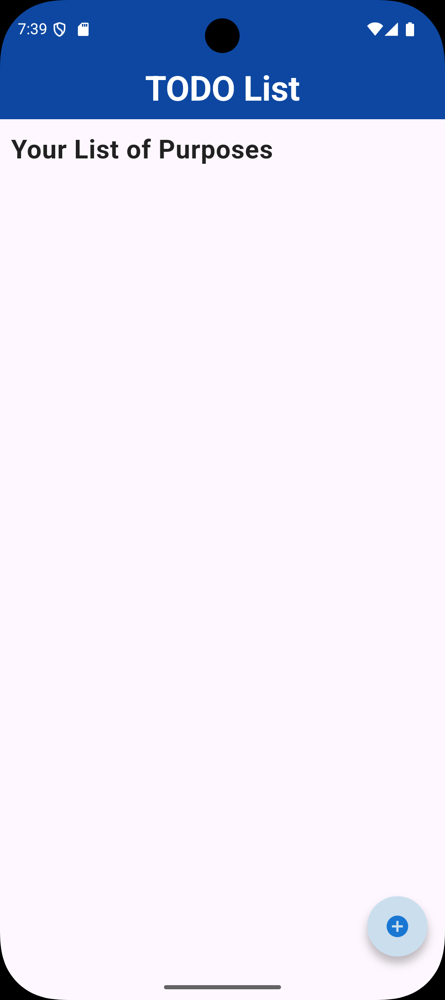
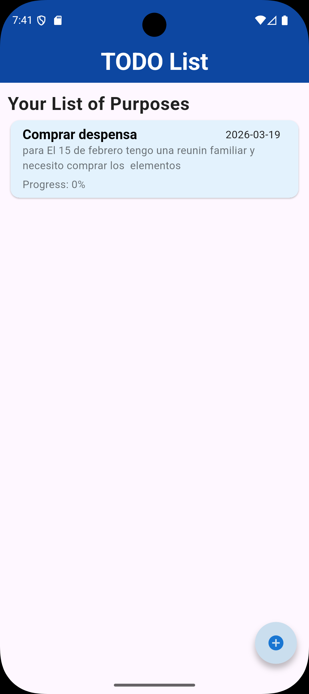
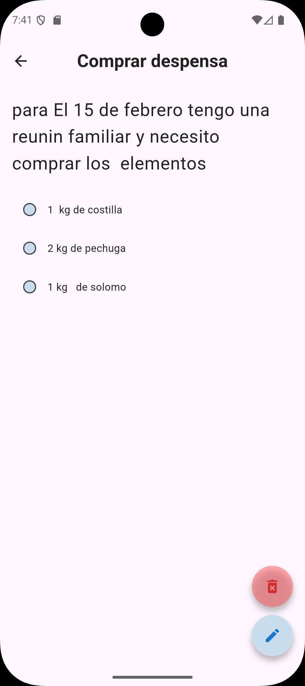
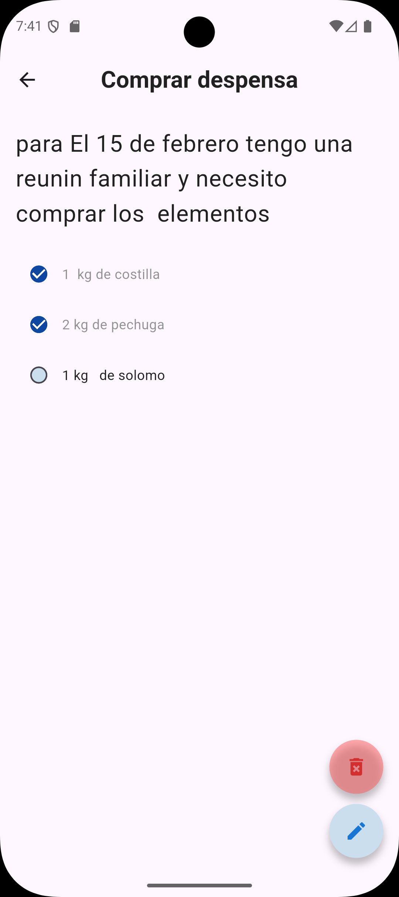
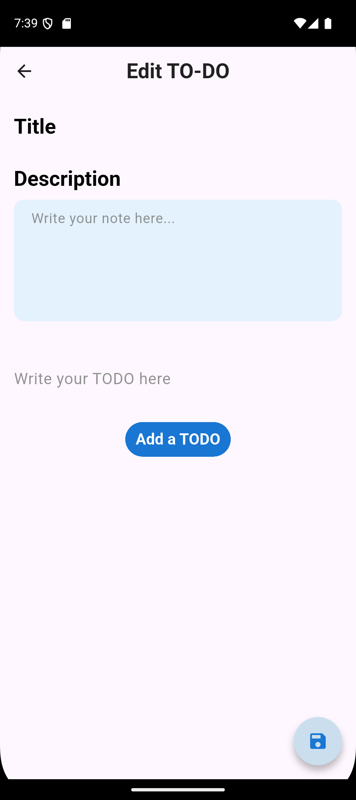
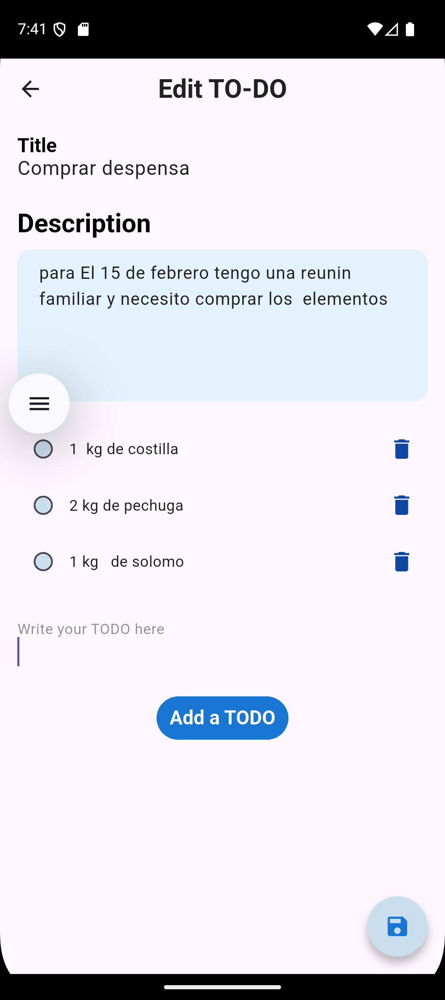

# Goals App

Aplicacion de TODOs hecha en Flutter para organizar metas, proyectos y tareas diarias. Incluye listado de metas, detalle con tareas internas y formularios para crear o editar.

## Caracteristicas
1. Crear, editar y eliminar metas (TODOs).
2. Marcar tareas como completadas dentro de cada meta.
3. Navegacion fluida entre listado, detalle y formulario.

## Tecnologias
1. Flutter
2. Dart

## Estructura General
1. `lib/` contiene la logica y las pantallas de la app.
2. `assets/` contiene las imagenes usadas en la documentacion.

## Pantallas

### Home Screen
Vista principal con tarjetas de cada meta y acceso rapido para agregar nuevas.




### Details Screen
Detalle completo de una meta con su lista de tareas y acciones.




### Form Screen
Formulario para crear o actualizar una meta con sus tareas.




## Como Ejecutar
1. Instala dependencias:

```bash
flutter pub get
```

2. Ejecuta la app:

```bash
flutter run
```

## Notas
Las imagenes de esta documentacion estan en `assets/image/`. Si deseas moverlas a `assets/images/`, tambien puedo actualizar las rutas.
